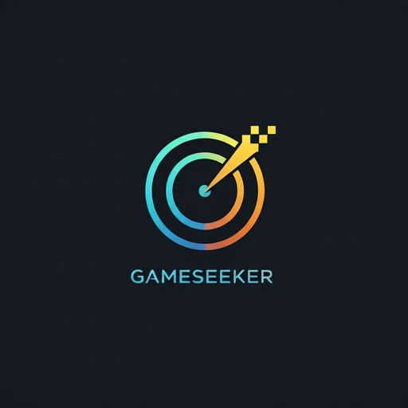
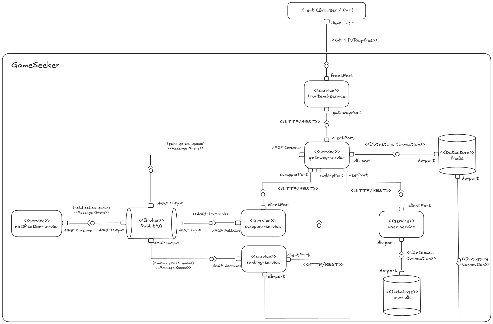
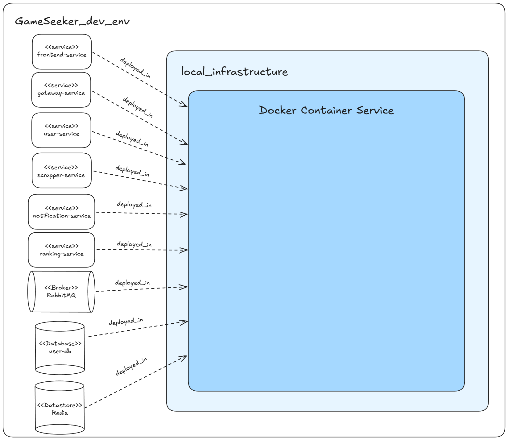
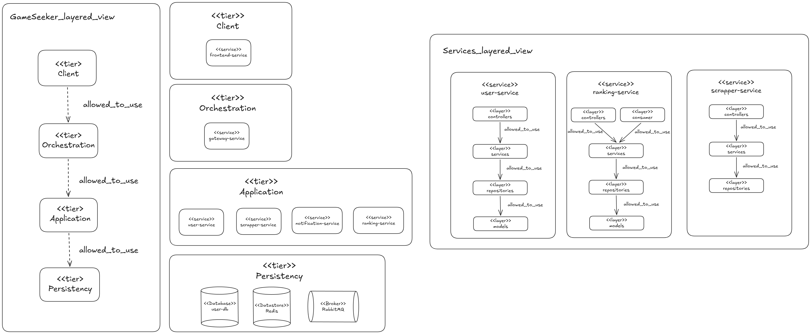
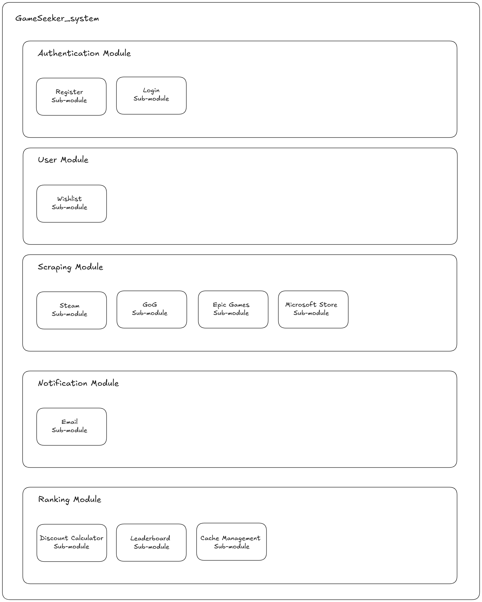

<div align="center">
  <!-- SPACE FOR LOGO -->
  <h1>GameSeeker</h1>
  <p><i>A unified platform to discover and track gaming deals across the digital landscape.</i></p>
</div>

GameSeeker is a web application designed to help gamers find the best prices for their favorite games across multiple digital storefronts (Steam, Epic Games, GOG) and manage a centralized wishlist. 

This project is built using a **Service-Oriented architecture** to ensure scalability, modularity, and separation of concerns.

---

# Prototype 2 - Delivery Document

This section contains the formal architectural documentation required for the Prototype 2 delivery.

## 1. Team
- Alejandro Arguello Muñoz
- Miguel Angel Buitrago Castillo
- Tomas Felipe Garzon Gomez
- Juan Sebastian Umaña Camacho
- Juan Luis Vergara Novoa

## 2. Software System
- **Name:** GameSeeker
- **Logo:**  
  
- **Description:** GameSeeker is a web application designed to help gamers find the best prices for their favorite games across multiple digital storefronts (Steam, Epic Games, GOG) and manage a centralized wishlist.


## 3. Platform Requirements

### 3.1. Functional Requirements

- **Game Search and Deal Tracking:** Users can search for games across varying storefronts (Steam, Epic, GOG) and find the best globally tracked deals.
- **Wishlist Management:** Users possess a centralized wishlist that they can modify.
- **Ranking and Trending Services:** The system tracks the top deals and price discounts dynamically via a leaderboard mechanism.
- **Notifications:** Users are alerted (via Email) when desired outcomes around deals are met.
- **Authentication:** Standard authentication registration and login schemas for user accounts.

### 3.2. Non-Functional Requirements

- **The software system must follow a distributed architecture.**
  *Fulfilled by utilizing a service-oriented architecture ecosystem natively separating domains (gateway, user, scrapper, ranking).*

- **The software system must include at least two different presentation-type components (one of them: web front-end).**
  *Fulfilled by the main Next.js web front-end UI and a secondary mobile application*

- **The web front-end must follow an SSR (Server-Side Rendering) subarchitecture.**
  *Fulfilled by Next.js 15 inside the `frontend-service`, natively optimizing SEO and initial loads with SSR.*

- **The software system must include at least four logic-type components.**
  *Fulfilled by `user-service`, `scrapper-service`, `ranking-service`, and `notification-service`.*

- **The software system must include at least one component that allows communication/orchestration between the logical components.**
  *Fulfilled by the `gateway-service` acting as an orchestrator/router, bridging requests seamlessly across domains.*

- **The software system must include at least four data-type components (including relational and NoSQL databases).**
  *Fulfilled by `user-db` (PostgreSQL relational database), `Redis` (NoSQL volatile data cache store), `RabbitMQ` (as an infrastructure message/queue datastore), and `SQLite` (lightweight embedded relational database).*

- **The software system must include at least one component that is responsible for handling asynchronous processes within the system.**
  *Fulfilled by `RabbitMQ`, capturing and forwarding asynchronous telemetry across event queues like `game_prices_queue`.*

- **The software system must include a set of HTTP-based connectors.**
  *Fulfilled by RESTful connections communicating vertically (client -> gateway -> internal services) and externally against storefront endpoints.*

- **The software system must be built using at least four different general-purpose programming languages.**
  *Fulfilled by our polyglot setup containing TypeScript (Frontend, Gateway, User, Notification), Python (Scrapper), Java (Ranking), and Swift (Mobile Application).*

- **The deployment of the software system must be container-oriented.**
  *Fulfilled leveraging Docker and Docker Compose for transparent virtualized deployments.*

---

## 4. Architectural Structures

### 4.1. Component-and Connector (C&C) Structure

**C&C View**



**Description of architectural elements and relations**
- **Client**: Initiates interactions via browser or raw fetches. Communicates securely with the frontend and gateway.
- **frontend-service**: Serves the user interface and acts as the immediate client access layer routing dynamic queries to the gateway.
- **gateway-service**: The core REST reverse-proxy. Protects access to backend paths dynamically routing to `scrapper-service`, `ranking-service`, and `user-service`. Persists connection to a `Redis` datastore for idempotency/blocking logic and acts as an AMQP Consumer for event-driven pricing flows.
- **scrapper-service**: External system boundary service scraping and pushing parsed responses autonomously wrapped as AMQP packages to `RabbitMQ`.
- **ranking-service**: Interacts synchronously with `user-db` for permanent configurations and accesses dynamic price data decoupled via `RabbitMQ`. 
- **notification-service**: Consumer isolated module strictly receiving triggers from the MQ.
- **Datastores**: `RabbitMQ` holds traffic asynchronously, `user-db` holds core domains, and `Redis` accelerates caching. 

**Description of architectural styles and patterns used**
- **Service-Oriented Architecture (SOA):** Core logic handles domains completely independent.
- **Publish-Subscribe (Pub/Sub):** Mediated by the RabbitMQ Message broker managing the queue traffic between scrapers, rankings, notifications, and gateways.
- **Client-Server & Pipe-and-Filter:** Synchronous streams filtered internally within the Gateway boundaries.
- **Layered Domain Architecture (User Service):** A data-centric pattern naturally separating concerns. The logic strictly follows a defined internal flow: **Route $\rightarrow$ Controller $\rightarrow$ Service $\rightarrow$ Repository**. 
- **Event-Driven UI:** The visual interface reacts instantly to price events pushed asynchronously from the server (Streaming SSE) without the need for manual page refreshes or costly constant polling.

### 4.2. Deployment Structure

**Deployment View**



**Description of architectural elements and relations**
- **local_infrastructure**: Represents the hardware and operating environment executing the stack.
- **Docker Container Service**: Interfacing runtime allocating network subnets and execution spaces.
- **Containers**: Eight natively segregated instances representing individual `deployed_in` mappings: Backend Services (`frontend-service`, `gateway-service`, `user-service`, `scrapper-service`, `notification-service`, `ranking-service`) and backing tools (`RabbitMQ`, `user-db`, `Redis`).

**Description of architectural patterns used**
- **Containerization Pattern**: Every module runs an isolated image holding its specific polyglot runtime ensuring absolute system portability across all machines.

### 4.3. Layered Structure

**Layered View**



**Description of architectural elements and relations**
- **Client Tier**: Direct consumer hardware abstractions. Interacts with the `Orchestration` tier using verified paths.
- **Orchestration Tier**: Represents the ingress API gateway deciding whether a request is authenticated (`allowed_to_use`) to permeate core services.
- **Application Tier**: Houses independent operational nodes (`user-service`, `scrapper-service`, `notification-service`, `ranking-service`). Additionally, individual nodes strictly separate logical inner flows as controllers -> services -> repositories -> models.
- **Persistency Tier**: Central storage mechanisms like relational `user-db`, temporary `Redis` stores, and `RabbitMQ` systems. Shielded entirely from exterior access.

**Description of architectural patterns used**
- **Layered Architecture**: Information strictly flows inward through `allowed_to_use` directives, preventing client bypassing to core Application logic or Persistency layer. 

### 4.4. Decomposition Structure

**Decomposition View**



**Description of architectural elements and relations**
- **Authentication Module**: Isolates Register and Login Sub-modules dynamically.
- **User Module**: Controls the internal Wishlist state and boundaries.
- **Scraping Module**: Groups discrete provider engines (Steam, GoG, Epic Games, Microsoft Store).
- **Notification Module**: Configures outgoing Email and alerting strategies.
- **Ranking Module**: Structures calculation hierarchies (Discount Calculator, Leaderboard algorithms, and volatile Cache Management sub-blocks).

---

## 5. Prototype

**Instructions for deploying the software system locally.**

To lift the GameSeeker prototype distributed architecture locally, you will need **Docker Desktop** running alongside **Docker Compose**.

1. **Environment Configuration (Crucial):** Before building the containers, you must ensure the secret keys are present in their respective service directories. The system will fail to initialize if these are missing:
    * **User Service:** Place the `BETTER_AUTH_SECRET` in `/user-service/.env`.
    * **Notification Service:** Place the `RESEND_API_KEY` in `/notification-service/.env`.

> **WARNING:** The deployment pipeline will be interrupted if the `.env` files are not correctly mapped. Please ensure the provided environment files are placed in the specific service folders before running the build command.

2. Open your terminal or bash IDE and navigate to the project's root folder (`/GameSeeker/`).
3. Trigger the pipeline to build and start the cluster securely in the background:
    ```bash
    docker-compose up --build -d
    ```
4. Docker will initialize the network sequence, launching data persistence nodes (`postgres, rabbitmq, redis`) concurrently followed by core application logic nodes via the Dockerfile maps. Look out for these bindings locally:
    * **Main UI Environment:** `http://localhost:3000`
    * **Core Gateway Router:** `http://localhost:8080`
    * **RabbitMQ Management Portal:** `http://localhost:15672`
5. After tests successfully finish, clean up the subnets safely from memory overhead:
    ```bash
    docker-compose down
    ```