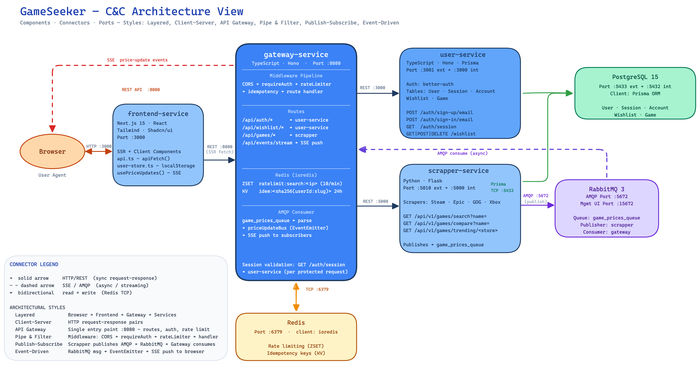
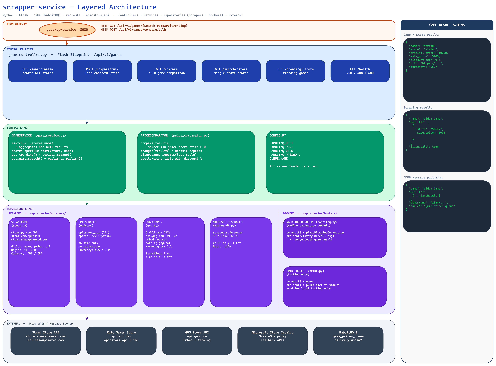

<div align="center">
  <!-- SPACE FOR LOGO -->
  <h1>GameSeeker</h1>
  <p><i>A unified platform to discover and track gaming deals across the digital landscape.</i></p>
</div>

GameSeeker is a web application designed to help gamers find the best prices for their favorite games across multiple digital storefronts (Steam, Epic Games, GOG, etc.) and manage a centralized wishlist. 

This project is built using a **Microservices Architecture** to ensure scalability, modularity, and separation of concerns.

## 🏗️ Architecture Overview

The system is composed of four main services and two backing services orchestrated via Docker Compose:

1. **User Service** (`/user-service`):
   - Handles user authentication, session management, and the user's personal wishlist.
   - Built with **Node.js, Hono, Prisma, and PostgreSQL**.
   - Exposes REST APIs documented via **Swagger (OpenAPI)**.

2. **Scraper Service** (`/scrapper-service`):
   - Responsible for scraping real-time game prices from various digital stores, comparing them, and finding trending games.
   - Built with **Python and Flask**.

3. **Gateway Service** (`/gateway-service`):
   - Single entry point for all client traffic. Proxies requests to `user-service` and `scrapper-service`, and validates sessions before forwarding protected routes.
   - Built with **TypeScript and Hono**. Listens on port **8080**.

4. **Frontend Service** (`/frontend-service`):
   - Web application that provides the user-facing UI for searching games, comparing prices, and managing wishlists.
   - Built with **Next.js 15, TypeScript, and Shadcn/ui**. Communicates exclusively with `gateway-service`.

5. **Backing Services**:
   - **PostgreSQL**: Primary relational database for the `user-service`.
   - **RabbitMQ**: Message broker used for asynchronous communication and background task queues (e.g., passing scraped trending games data).
   - **Redis**: Rate limiting and key-value store cache.

---

# 🎓 Prototype 1 - Delivery Document

This section contains the formal architectural documentation required for the Prototype 1 delivery.

## 1. Team
- **Alejandro Arguello Muñoz** 
- **Miguel Angel Buitrago Castillo** 
- **Tomas Felipe Garzon Gomez:** 
- **Juan Sebastian Umaña Camacho** 
- **Juan Luis Vergara Novoa** 

## 2. Software System
- **Name:** GameSeeker
- **Logo:**  
  
- **Description:** GameSeeker is a web application designed to help gamers find the best prices for their favorite games across multiple digital storefronts (Steam, Epic Games, GOG, etc.) and manage a centralized wishlist. 

---

## 3. Architectural Structures

### 3.1. Component-and-Connector (C&C) View
**Component-and-Connector View**



**Scrapper Service Layered View**



### 3.2. Description of Architectural Styles Used
The GameSeeker ecosystem relies on a hybrid architecture that incorporates multiple styles to ensure scalability, low coupling, and reactivity:

- **Microservices Architecture:** The system separates domains (e.g., user authentication versus web scraping) into independent services. This allows us to scale components based on what they individually need—fast network I/O or heavy CPU processing mapping algorithms.
- **API Gateway Pattern:** We expose the hidden cluster behind a single external boundary on port `:8080` (Gateway Service), unifying security, rate limiting, and CORS routing logically in one place to protect the backend.
- **Publish-Subscribe (Pub/Sub):** Mediated by RabbitMQ, this pattern handles asynchronous messages. It spatially decouples the service that produces unpredictable data (the scraper tracking worldwide deals) from the service that consumes and visualizes it (the gateway and browser).
- **Client-Server & Layered:** There is a strict layered separation between the client browser (View level) and the backend server layer, protecting our databases from external access.
- **Pipe and Filter:** Incoming HTTP requests pass through a sequential pipeline of middleware restrictions internally in the Gateway (`CORS -> Auth Validation -> Rate Limiter -> Idempotency Check -> Route Handler`).
- **Layered Domain Architecture (User Service):** A data-centric pattern naturally separating concerns. The logic strictly follows a defined internal flow: **Route $\rightarrow$ Controller $\rightarrow$ Service $\rightarrow$ Repository**. 
- **Event-Driven UI:** The visual interface reacts instantly to price events pushed asynchronously from the server (Streaming SSE) without the need for manual page refreshes or costly constant polling.

### 3.3. Description of Architectural Elements and Relations
This section describes each architectural element visible in the C&C diagram, its responsibilities, technologies, and its connectors (relations) with other elements in the cluster.

#### A. Presentation Elements

**1. Browser (User Agent)**
- **Responsibility:** The client device executing the web application.
- **Relations:** Maintains an asynchronous HTTP connection pointing to the Frontend Service `:3000` and receives unidirectional Server-Sent Events (SSE) streams from the Gateway.

**2. Frontend Service (`frontend-service`)**
- **Responsibility:** Manages the virtual DOM, compiles UI components ("Digital Sanctuary" design via Tailwind/Shadcn), and persists visual session states (`localStorage`). Uses Hybrid Rendering (CSR/SSR).
- **Relations:**
  - **`REST HTTP Server Fetcher (Synchronous):`** Connects to the Gateway Service via synchronous Request-Response interactions.
  - **`SSE Web Client (Streaming River):`** Maintains a continuous open connection to the Gateway (`/api/events/stream`) to inject real-time updates smoothly using the `usePriceUpdates()` hook.

#### B. Mediation and Orchestration Elements

**3. Gateway Service (`gateway-service`)**
- **Responsibility:** An orchestrator and reverse proxy that protects against network abuse. It evaluates session cookies locally or forwards the check in real-time, limits request rates, and checks idempotency before routing to internal services. Written in TypeScript (Hono).
- **Relations:**
  - **`REST Proxy Client Engine:`** Modifies headers and redirects HTTP flows to the `user-service` (port 3000) and `scrapper-service` (port 5000).
  - **`Auth Session Interceptor:`** Before routing protected endpoints, it triggers a synchronous check (`GET /auth/session`) to the User Service.
  - **`Redis TCP Client:`** Connects to Redis (port 6379) using `ioredis` to write IP rate limit structures (ZSET 10 ops/min) and idempotency hashes (KV 24h).
  - **`AMQP Consumer Channel:`** An async worker actively consuming serialized messages from the `game_prices_queue` shared RabbitMQ queue.
  - **`SSE HTTP Push Origin:`** Unpacks price events and transmits them to connected browsers via a Server-Sent Events stream local bus (`EventEmitter`).

#### C. Core Logic and Domain Elements

**4. User Service (`user-service`)**
- **Responsibility:** Owns the Identity and Security domain. It handles login registrations (`POST /auth/sign-in/email`), validates sessions wrapped with `better-auth`, and manages CRUD operations for users' personal `Wishlist` tables.
- **Relations:**
  - **`REST Sub-Server Routing Receptor:`** Receives internal HTTP calls successfully redirected from the Gateway Proxy.
  - **`Prisma SQL Relational Client:`** A persistent, asynchronous TCP connection (port 5432) to the PostgreSQL database to query and mutate tables securely (`User`, `Session`, `Account`, `Wishlist`, `Game`).

**5. Scrapper Service (`scrapper-service`)**
- **Responsibility:** Main service of the systemn written in Python (Flask). It searches concurrently (`/search`), performs fuzzy matching to normalize game titles across different storefronts, and formats the best global deals converted into a chosen currency.
- **Relations:**
  - **`REST Framework Listener (WSGI):`** Listens to standard `GET` HTTP queries dispatched by the Gateway Proxy.
  - **`AMQP Message Publisher:`** Actively pushes tracked price payloads asynchronously to the architecture's RabbitMQ broker (`game_prices_queue`).
  - **`Prisma TCP Direct Extractor:`** An independent ORM client that directly points and injects game tracking data natively into the consolidated PostgreSQL relational tables.
  - **`Third-Party Rest/DOM Extractors:`** Outgoing external request fetchers reacting and parsing HTML documents and REST APIs operated by official game distributors (Steam, Epic, GOG, Xbox).

#### D. Backing Services (Data and Infrastructure)

**6. PostgreSQL 15 (Relational Engine)**
- **Responsibility:** Master ACID storage representing the single source of truth for the system's structured data.
- **Relations:** Receives exclusive concurrent connections natively on TCP port `5432` from two independent Prisma Clients: the `user-service` and the `scrapper-service`.

**7. Redis (In-Memory Volatile KV Cache)**
- **Responsibility:** High-speed memory storage successfully handling rate limit quotas and blocking logic.
- **Relations:** Receives TCP commands securely on port `6379`, strictly used by the `gateway-service`.

**8. RabbitMQ 3 (Pub/Sub Broker)**
- **Responsibility:** Heart of the asynchronous channel. It manages traffic queues efficiently, mitigating bottlenecks between the heavy scrapers and the UI.
- **Relations:** Communicates securely on AMQP port `5672`, natively receiving published messages from the `scrapper-service` and serving them instantly to the `gateway-service` consumer.

---

## 4. Prototype Deployment (Local Instructions)

To lift the GameSeeker distributed architecture locally, you will need **Docker Desktop** running alongside **Docker Compose**.

1. Open your terminal or bash IDE and navigate to the project's root folder where the `docker-compose.yml` file lives (`/GameSeeker/`).
2. Trigger the pipeline to build and start the containers in the background:
   ```bash
   docker compose up --build -d
   ```
3. Docker will automatically set up the virtual bridge network, deploy the databases (`postgres, rabbitmq, redis`), and subsequently build the peripheral routine interfaces (`frontend, gateway, user, scrapper`). Check these active endpoints on your local browser:
   * **Main UI Dashboard (React / Next.js):** `http://localhost:3000`
   * **Central Proxy (Gateway REST & SSE):** `http://localhost:8080`
   * **OpenAPI Documentation Console (User Service GUI):** `http://localhost:3001/ui`
   * **Message Broker Management Console (RabbitMQ UI):** `http://localhost:15672` (using default credentials).
4. After completing your local tests, gracefully tear down the network and remove the temporary subnets so they don't consume memory in the background:
   ```bash
   docker compose down
   ```
